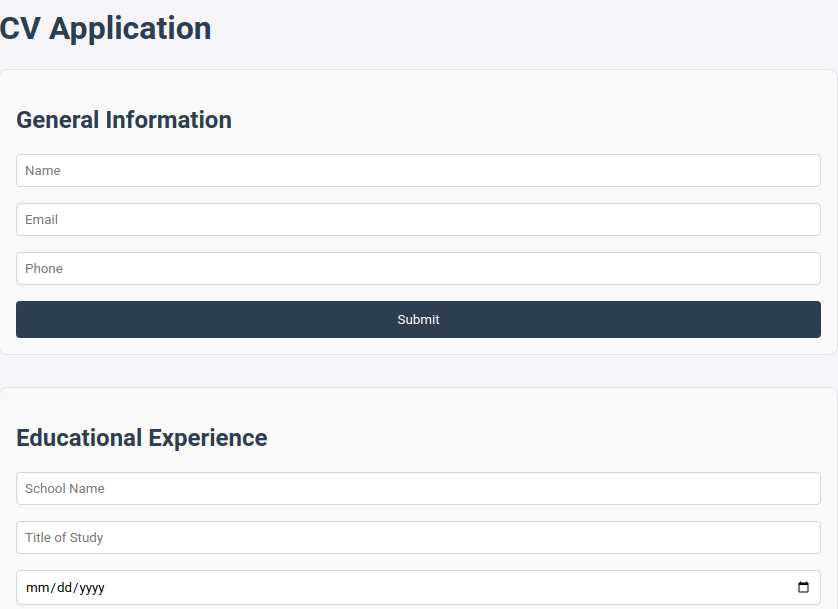
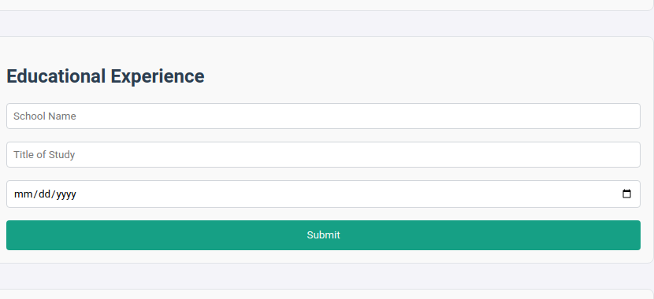
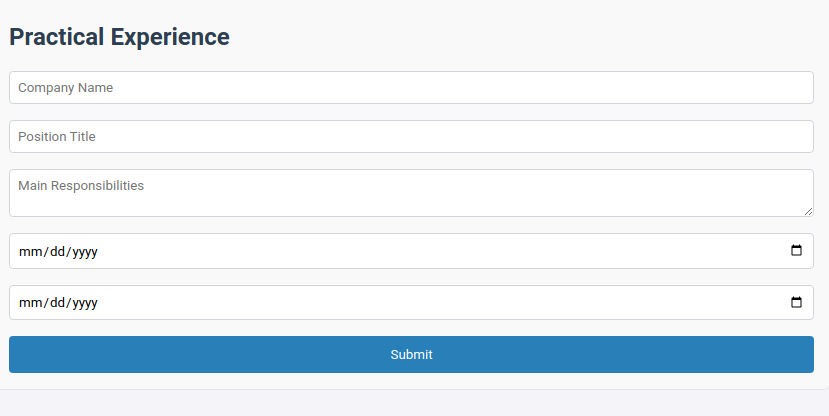

# CV Application

A modern, responsive CV Application built using **React** and **Vite**. This application allows users to create, edit, and preview their CV with a user-friendly interface and responsive design.

---

## Features

- **General Information Section**  
  Add, edit, and display details like name, email, and phone number.
  
- **Educational Experience Section**  
  Add, edit, and display your educational background (school name, title of study, and dates).

- **Practical Experience Section**  
  Add, edit, and display your work experience, including company name, position, main responsibilities, and work duration.

- **Edit/Submit Functionality**  
  - View submitted data dynamically.
  - Reopen input fields to update information.

- **Responsive Design**  
  Optimized for both desktop and mobile devices.

---

## Project Structure

```
src/
├── components/           # Reusable React components
│   ├── GeneralInfo.jsx          # General information form
│   ├── EducationalExperience.jsx # Educational experience form
│   ├── PracticalExperience.jsx   # Practical experience form
├── styles/               # Component-specific styles
│   ├── GeneralInfo.css
│   ├── EducationalExperience.css
│   ├── PracticalExperience.css
│   └── App.css
├── App.jsx               # Main application component
├── main.jsx              # React entry point
├── index.css             # Global styles
```

---

## Technologies Used

- **React**: Frontend library for building the UI.
- **Vite**: Fast development build tool.
- **CSS**: For styling and responsive design.

---

## Installation and Setup

Follow these steps to run the project locally:

1. Clone the repository:
   ```bash
   git clone https://github.com/your-username/react-cv-app.git
   cd react-cv-app
   ```

2. Install the required dependencies:
   ```bash
   npm install
   ```

3. Start the development server:
   ```bash
   npm run dev
   ```

4. Open your browser and navigate to `http://localhost:5173/`.

---

## 🌐 Live Demo

Check out the live version of the application here: [Live Demo](https://your-deployment-link.com)

---

## Screenshot

### Desktop View



---